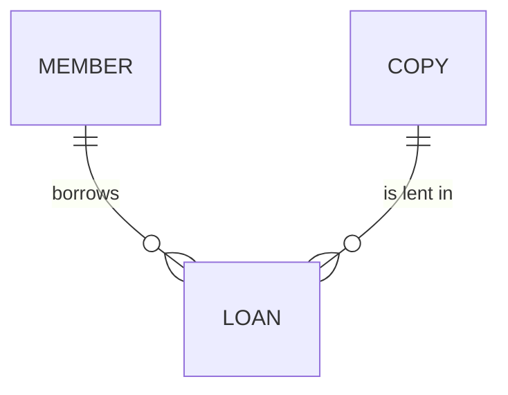

# Entity Model

### MEMBER

A registered person who may borrow copies.

| Attribute  | Description                 | Data Type | Length/Precision | Validation Rules    |
|------------|-----------------------------|-----------|------------------|---------------------|
| id         | Unique identifier           | Long      | 19               | Primary Key, Not Null |
| name       | Full name                   | String    | 100              | Not Null            |
| email      | Email address               | String    | 255              | Not Null, Unique    |
| birth_date | Date of birth               | Date      | -                | Not Null            |

### COPY

One physical exemplar of a book title.

| Attribute | Description           | Data Type | Length/Precision | Validation Rules                  |
|-----------|-----------------------|-----------|------------------|-----------------------------------|
| id        | Unique identifier     | Long      | 19               | Primary Key, Not Null             |
| title     | Title of the book     | String    | 200              | Not Null                          |
| status    | Availability          | String    | 20               | Not Null, Values: Available, On Loan |

### LOAN

A copy lent to a member.

| Attribute | Description       | Data Type | Length/Precision | Validation Rules                |
|-----------|-------------------|-----------|------------------|---------------------------------|
| id        | Unique identifier | Long      | 19               | Primary Key, Not Null           |
| member_id | Borrowing member  | Long      | 19               | Not Null, Foreign Key (MEMBER.id) |
| copy_id   | Lent copy         | Long      | 19               | Not Null, Foreign Key (COPY.id) |
| loan_date | Date of the loan  | Date      | -                | Not Null                        |
| due_date  | Date the copy is due back | Date | -              | Not Null                        |
