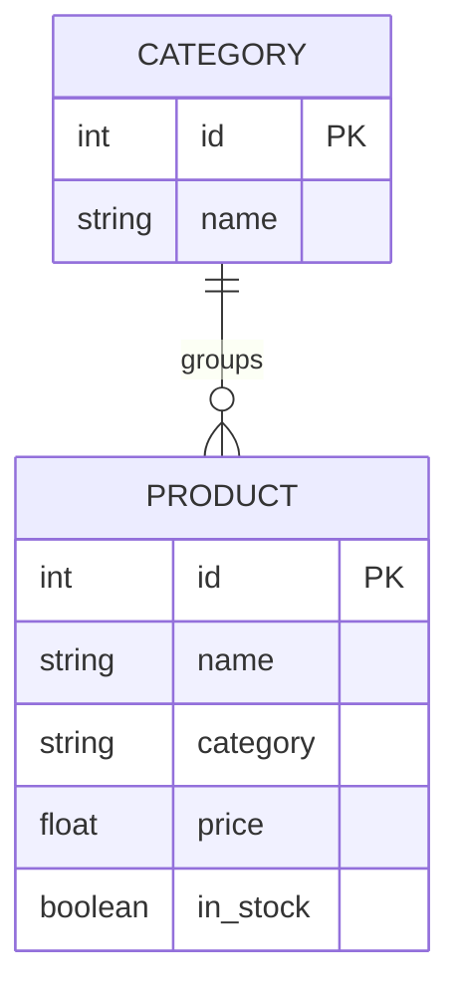

# Entity Model

## CATEGORY

| Attribute | Type    | Required | Rules                        |
|-----------|---------|----------|------------------------------|
| id        | integer | yes      | Primary key, generated       |
| name      | text    | yes      | Display name of the category |

## PRODUCT

| Attribute | Type    | Required | Rules                                                   |
|-----------|---------|----------|---------------------------------------------------------|
| id        | integer | yes      | Primary key, generated                                  |
| name      | text    | yes      | Display name of the product                             |
| category  | text    | yes      | Category name this product belongs to                   |
| price     | decimal | yes      | Must not be negative                                    |
| in_stock  | boolean | yes      | Defaults to true; false means the product is unavailable |

## Notes

`in_stock` governs catalogue visibility (BR-010). It is a stock flag, not a soft-delete marker —
an out-of-stock product remains in the catalogue data and becomes visible again when restocked.
