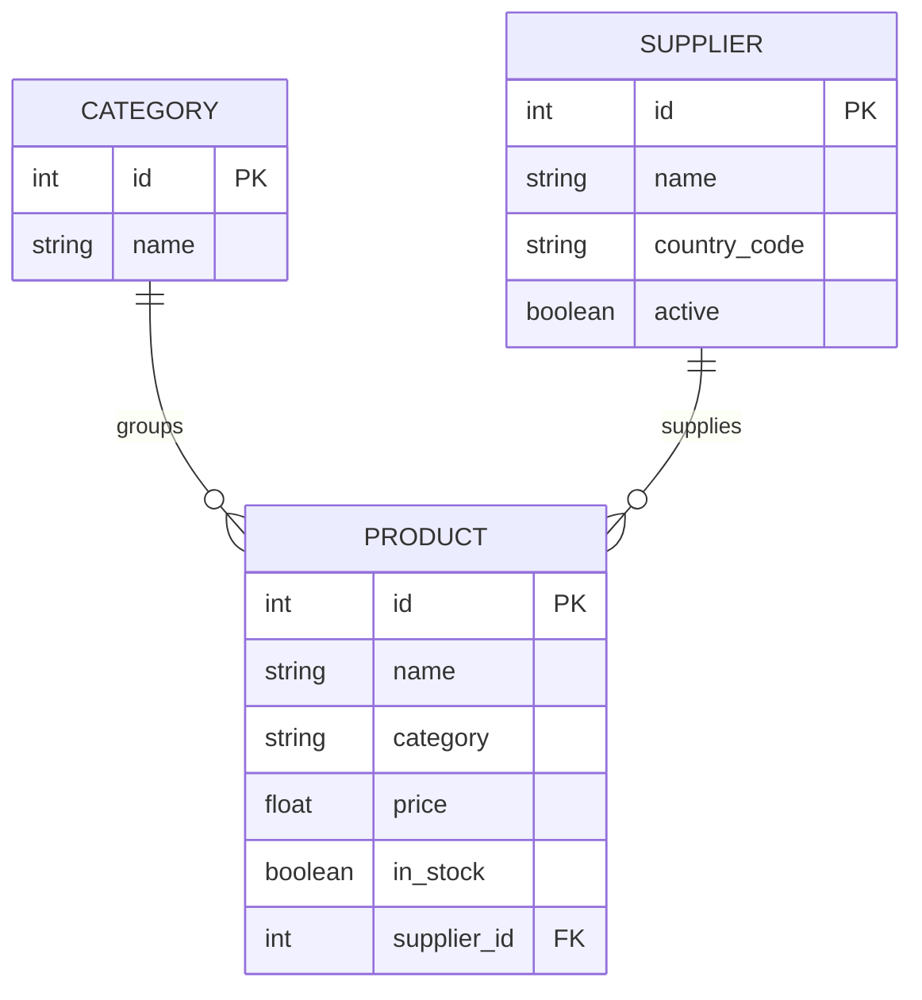

# Entity Model

## CATEGORY

| Attribute | Type    | Required | Rules                        |
|-----------|---------|----------|------------------------------|
| id        | integer | yes      | Primary key, generated       |
| name      | text    | yes      | Display name of the category |

## PRODUCT

| Attribute   | Type    | Required | Rules                                                        |
|-------------|---------|----------|--------------------------------------------------------------|
| id          | integer | yes      | Primary key, generated                                       |
| name        | text    | yes      | Display name of the product                                  |
| category    | text    | yes      | Category name this product belongs to                        |
| price       | decimal | yes      | Must not be negative                                         |
| in_stock    | boolean | yes      | Defaults to true                                             |
| supplier_id | integer | **no**   | Optional reference to the SUPPLIER that supplies this product |

## SUPPLIER

| Attribute    | Type    | Required | Rules                                                      |
|--------------|---------|----------|------------------------------------------------------------|
| id           | integer | yes      | Primary key, generated                                     |
| name         | text    | yes      | Trading name of the supplier                               |
| country_code | text    | yes      | Exactly two uppercase letters (ISO 3166-1 alpha-2)         |
| active       | boolean | yes      | Defaults to true; false means the supplier is discontinued |

## Notes

A product may have no supplier — stock produced in-house has no external supplier, so
`supplier_id` is nullable.

Discontinuing a supplier must not remove the products it supplied, nor the purchase history behind
them. That is what `active` is for; supplier rows are never deleted in normal operation.
